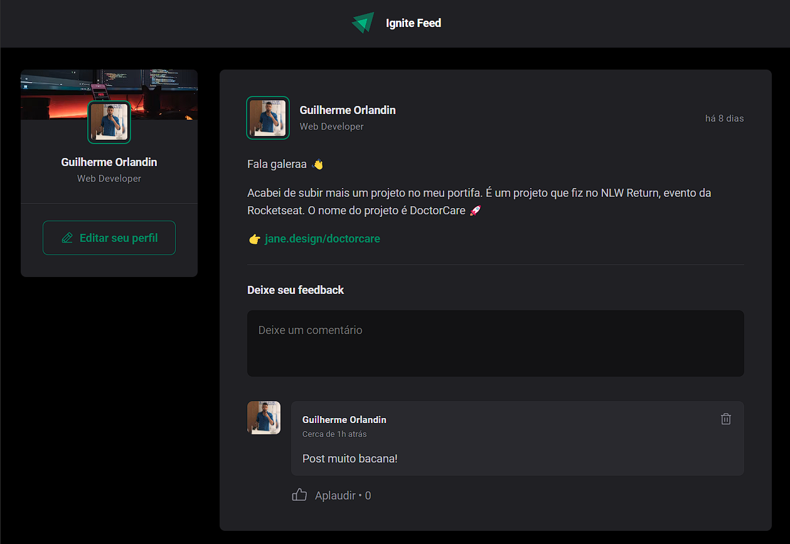

</div>

## ▶ Preview

[](https://ingite-feed.vercel.app/)

## 📃 About

Ignite feed trata-se de um projeto em que simula uma rede social, podendo aplaudir alguns comentários e caso não goste do seu comentário também pode deleta-lo
## 🎨 Layout

- [Layout Figma - Original](https://www.figma.com/file/7Cwub6u2QyN78Aj0l57mXS/Ignite-Feed-(Community)?node-id=0%3A1&t=uwU9bChdIiczu6gt-0)

## 🛠 Build with

- [HTML]()
- [CSS]()
- [TypeScript]()

## 🎞 Demo



## ⚙ Features


## 💻 Getting started

```sh
git clone https://github.com/GuiOrlandin/Ingite-Feed.git && cd Ingite-Feed
```

Download [live server](https://marketplace.visualstudio.com/items?itemName=ritwickdey.LiveServer) extension on vscode and run.